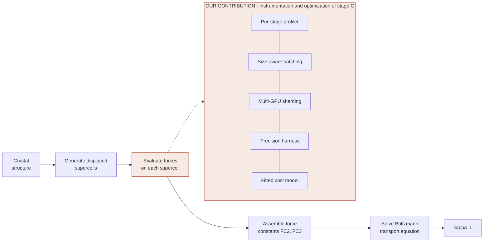

# End-to-End Cost of Thermal Conductivity Prediction: Machine-Learned Potentials versus DFT

**CSCE 585 — Machine Learning Systems — Fall 2026**

---

## Team and Responsibilities

| Member | Program | Role | Primary ownership |
|---|---|---|---|
| Ramm Chevva | PhD, CS | Project lead, domain and integration | Reference dataset, structure selection, correctness of the physics, accuracy axis (RQ3), final integration |
| Thrinadh Nimmagadda | MS, CS | Systems and throughput | Per-stage profiler, size-aware batching, multi-GPU sharding (RQ1, RQ2) |
| Divyashanu Swain | MS, CS | Evaluation and reproducibility | Sweep driver, precision harness, statistics, all figures, reproducibility plan (RQ4) |

Neither systems role requires materials science background: the harness receives crystal structures and returns forces, and the work inside it is GPU throughput and measurement engineering.

**Coordination.** Weekly 45-minute sync. One shared GitHub repository. One GitHub issue thread per research question, used as the running design record. All configuration files and raw timing outputs are committed as produced.

**Progress record.** Decisions are recorded as a comment on the relevant RQ issue and referenced by issue number in the implementing commit. Each milestone closes with a short dated note in `README.md` stating what was completed and by whom, so individual contribution stays visible from commit history plus those notes.

**Shared understanding.** Every member must be able to explain the final figures, not only their own component. The last 20 minutes of each sync is reserved for whoever did *not* write that week's code to walk through the results.

---

## Feedback Received and Responses

**Feedback (idea presentation, Aug 28).** The instructor asked what "MLIP" means.

**Response given.** MLIPs are neural networks trained on thousands of crystal structures, from which they learn the physics and chemistry of how atoms interact.

**Expanded response, now incorporated throughout this document.** A machine-learned interatomic potential is a neural network trained on a large archive of completed DFT calculations -typically hundreds of thousands to millions of structures, each labelled with the energy and the per-atom forces that DFT computed for it. The network learns the mapping from a local atomic neighbourhood to the force on the atom at its centre. Because that mapping is what the underlying physics determines, a well-trained model effectively absorbs the interatomic physics and chemistry of crystals without solving any quantum mechanics at run time.

The practical consequence is a drop-in substitution: the model takes the same input as DFT (atomic positions), returns the same output (forces on each atom), runs roughly a thousand times faster, and carries some error. We use a pretrained model, **NequIP-OAM-L**, and train nothing ourselves. Accuracy comparisons across such models are maintained by the community at **Matbench Discovery** (<https://matbench-discovery.materialsproject.org/>), which ranks them on nine accuracy metrics - and, notably for this project, on no cost metric at all.

Acting on this feedback, every domain term in this proposal is now defined at first use, the framing leads with the systems question rather than the materials science, and short explanations of DFT and of why thermal conductivity is unusually expensive have been added below.

---

## Problem and Motivation

### What we compute, and for whom

Thermal conductivity, written κ_L and measured in W·m⁻¹·K⁻¹, is how fast heat moves through a solid. It matters for chip packaging, heat spreaders, power electronics and thermoelectrics.

Candidate crystal structures come from public databases or from generative pipelines built elsewhere. **We do not generate structures and we do not train a network to predict κ_L directly.** Given a structure that already exists as a candidate, κ_L must be *computed* from physics, and that computation is what is expensive. The affected users are computational materials groups running screening campaigns under a fixed HPC allocation, who must decide which candidates to evaluate and at what settings.

### What DFT is, and how it works

Atoms in a crystal are nuclei surrounded by electrons, and the forces holding the atoms in place come from those electrons. **Density Functional Theory (DFT)** computes them.

Given fixed nuclear positions, DFT solves for the electron density by iteration: guess a density, compute the electric potential it creates, solve for the electron states in that potential, obtain a new density, and repeat until the density stops changing. That loop is the self-consistent field (SCF) cycle. Once it converges, the total energy follows, and the force on every nucleus is read off analytically from the converged density.

So DFT is effectively one very expensive function: **atomic positions in, energy and per-atom forces out.** Cost grows roughly as the cube of the electron count, so a 64-atom cell takes minutes to hours on a many-core node.

### Why κ_L costs far more than other screened properties

Most screened properties are read off a single converged calculation. κ_L is not. The difference is the *order of derivative* of the energy that the property requires:

| Property | What it needs | Approximate DFT runs |
|---|---|---|
| Formation energy, stability | Total energy of the relaxed structure | 10–50 (the relaxation) |
| Band gap | One extra non-self-consistent pass | +1–2 |
| Elastic constants | Strain the cell several ways, read the stress | 20–50 |
| Phonons, dynamic stability (FC2) | Displace single atoms | 10–500 |
| **Thermal conductivity (FC3)** | **Displace pairs of atoms** | **10³–10⁴** |

Energy is the zeroth derivative and is free. Forces are the first derivative and are also effectively free, since DFT produces them analytically. Second-order force constants (FC2) are the second derivative: you displace one atom at a time and difference the forces, so the run count scales with the number of atoms. Third-order force constants (FC3) are the third derivative: you must displace *pairs* of atoms, so the run count scales with the number of atom pairs.

FC3 is not an optional refinement. Without it, vibrational waves in the crystal would never scatter off one another and every material would have infinite thermal conductivity. FC3 is precisely what makes κ_L a finite number, and it is what makes it expensive.

### Preliminary evidence (measured, not cited)

Using `phono3py` 4.4.0 we counted the required force evaluations for a 64-atom silicon supercell, then repeated the count on the identical cell with atoms randomly perturbed by ~0.05 Å so that no symmetry operation is detected. This is a synthetic control in which the only variable is symmetry:

| Configuration | Silicon (Fd-3m) | Identical cell, symmetry removed (P1) |
|---|---|---|
| Finite displacement, no pair cutoff | 111 | 18,480 |
| Finite displacement, 4 Å pair cutoff | 31 | 4,800 |
| Regression fit (`hiphive`, FC3 cutoff 3.5 Å) | 1 configuration | 48–144 configurations |

Symmetry determines *how many* evaluations are needed; chemistry only determines the price of each one. Symmetry is a property of the material, not a setting anyone chooses.

### The gap

Two independent remedies exist, developed by separate communities. MLIPs make each force evaluation ~10³× cheaper [1,2]. Regression-based force-constant extraction reduces how many evaluations are needed [4,5]. Neither community measures the other's approach, and neither reports end-to-end cost.

Matbench Discovery [3] ranks nine accuracy metrics and contains no cost column: no GPU-hours, no wall-clock, no energy. The one published accuracy-versus-speed frontier for κ [2] measures forward passes per second on a fixed 1000-atom system, at batch size 1, on a single GPU, with graph-construction time excluded — a model microbenchmark, not the cost of producing a κ_L value.

A practitioner with a fixed allocation therefore cannot answer the operational question — *given this budget, which settings maximize the number of materials I get right?* — from anything in the literature.

**Risk note.** Screening campaigns of this kind consume substantial compute, so reporting accuracy while treating compute as free obscures the environmental cost of the practice. Energy is therefore one of our reported metrics rather than an afterthought. No privacy, fairness or security exposure exists: all inputs are crystal structures from public databases or our own calculations.

---

## Research Questions and Hypotheses

**RQ1 — Where does wall-clock time go in an MLIP-driven FC3 workflow, and what fraction falls outside model inference?**

*H1:* Input graph construction will account for at least 25% of GPU wall-clock time. Molecular dynamics amortizes neighbour-list construction across thousands of sequential steps; here every supercell is evaluated exactly once, so it is rebuilt every time. This is the cost published throughput benchmarks exclude [2].

**RQ2 — In a screening queue of materials with differing supercell sizes, how much does size-aware batching improve throughput over naive padding, and how does the workflow scale across GPUs?**

*H2:* Size-aware bucketing will improve throughput by at least 1.5× at batch size 64, with the margin growing with batch size, because padding waste scales with the spread of supercell sizes in a batch. Multi-GPU scaling efficiency will exceed 80% at 3 GPUs, since the work is embarrassingly parallel.

**RQ3 — Across the four combinations of force source (DFT, MLIP) and extraction method (finite displacement, regression), what is the accuracy-versus-compute frontier, and do the two cost reductions compose?**

*H3:* The savings will **not** compose multiplicatively. Once the MLIP replaces DFT, force evaluation ceases to dominate runtime, so cutting the evaluation count ~50× via regression will yield substantially less than 50× end-to-end speedup — an Amdahl's-law ceiling set by graph construction, force-constant assembly and the transport solve.

**RQ4 — Does reduced-precision inference change the predicted κ_L beyond the model's own error?**

*H4:* fp32 will change κ_L by less than 1% relative to fp64; tf32 by more than 1%. Force constants are computed by differencing nearly equal forces, and third-order constants difference twice, so mantissa loss compounds. A preliminary simulation of this differencing chain gave 0.0001% (fp32) and 2.04% (tf32) error on a model third derivative, with third-order error roughly twelve times the second-order error. This matters because tf32 is enabled by default on Ampere-generation and later NVIDIA GPUs.

---

## Proposed System or Approach

Grey stages are existing software used unmodified. All our engineering lives in stage C.

| Component | Input | Output | Built by |
|---|---|---|---|
| Displacement generator | Structure, supercell matrix, cutoff | Displaced supercells | `phono3py` / `hiphive` (reused) |
| **Force-evaluation service** | Batch of supercells | Forces, eV·Å⁻¹ | **Ours** — wraps NequIP-OAM-L or dispatches DFT |
| **Profiler** | Timing hooks on every stage | Per-stage wall-clock (s), GPU utilization (%) | **Ours** |
| **Batch scheduler** | Queue of mixed-size supercells | Size-bucketed batches | **Ours** |
| **Precision harness** | Model, precision flag | Forces at fp64 / fp32 / tf32 | **Ours** |
| Force-constant assembler | Displacements + forces | FC2, FC3 | `phono3py` / `hiphive` (reused) |
| Transport solver | FC2, FC3, q-mesh | κ_L (W·m⁻¹·K⁻¹) | `phono3py` (reused) |
| **Cost model** | All logged runs | Predicted node-hours for a material and settings | **Ours** |

**Reused dependencies:** `phono3py` 4.4.0, `phonopy` 4.4.0, `hiphive` (pinned release), NequIP-OAM-L pretrained weights (checkpoint hash pinned in `env/models.lock`), `scikit-learn`, ASE, pymatgen, VASP. All pinned by version or commit hash in `env/environment.yml`.

**What we replicate:** the κ_SRME accuracy evaluation of a foundation MLIP against the 103-solid reference set of [1], and the regression extraction procedure of [4]. Replication succeeds if our κ_SRME for NequIP-OAM-L falls within the published spread for MPtrj-class models, confirming correct pipeline configuration.

**The extension, stated separately:** the cost axis. None of [1]–[4] reports end-to-end wall-clock or compute for producing a κ_L value. Our extension is the per-stage cost decomposition (RQ1), the batching and multi-device optimization of stage C (RQ2), the joint accuracy-cost frontier across the four combinations (RQ3), and the precision study (RQ4).

**Out of scope:** no new model architecture; no training or fine-tuning; no new DFT campaigns beyond the 3–5 structures needed for timing and reference; metals and the electronic contribution to conductivity excluded (we study κ_L = κ_P + κ_C for non-metals).

---

## Evaluation Plan

**RQ-to-experiment mapping**

| RQ | Experiment | Primary metric | Baseline |
|---|---|---|---|
| RQ1 | Instrument every stage; run full workflow at fixed settings | Wall-clock fraction per stage (%) | Uninstrumented total (confirms overhead < 3%) |
| RQ2 | Sweep batch size × strategy × GPU count on a mixed-size queue | Throughput (structures·s⁻¹) | Naive padding, batch 1, single GPU |
| RQ3 | Full 2×2 over force source × extraction method, swept over cost knobs | κ_L error (%) vs node-hours | DFT + finite displacement at converged settings |
| RQ4 | Repeat force evaluation at fp64 / fp32 / tf32 | \|Δκ_L\| (%), speedup (×) | fp64 |

**Datasets and workloads.** *Accuracy:* the 103-solid DFT reference set from [1], public and versioned (N = 103). *Cost and timing:* 3–5 structures we run DFT on ourselves, spanning symmetry classes, producing measured per-SCF cost on our hardware. *Throughput (RQ2):* a synthetic screening queue of ≥200 supercells spanning ~32–250 atoms. Note that within a single material all displaced supercells share an atom count; size heterogeneity is a property of the *queue*, which is why RQ2 is posed at screening level.

**Baselines and ablations.** Baselines: (a) DFT + finite displacement at converged settings, the accuracy gold standard; (b) MLIP at batch size 1, fp64, single GPU, naive padding — the configuration published speed figures implicitly assume. Ablations remove, one at a time: size-aware bucketing, multi-GPU, regression, reduced precision.

**Varied factors.** Force source (DFT, NequIP-OAM-L) · extraction method (finite displacement, regression) · fitting backend (OLS, LASSO, RFE) · batch size (1, 4, 16, 64, 256) · batching strategy (naive, size-bucketed) · precision (fp64, fp32, tf32) · GPUs (1–3 × RTX-3090, 1 × A100) · FC3 supercell (2×2×2, 3×3×3) · pair cutoff (none, 4 Å, 5 Å) · q-mesh (11³, 15³, 21³) · symmetry class (high-symmetry, P1).

**Controlled factors.** Displacement amplitude 0.03 Å · `primitive_matrix='P'` (removes a known nondeterminism source) · two-channel transport `transport_type="smm19"` so κ_L = κ_P + κ_C on both sides of every comparison · identical structure set · pinned environment · same node type within any timing comparison · exclusive node allocation for all timed runs.

**Metrics, with units.** *System:* end-to-end wall-clock per material (s) · throughput (structures·s⁻¹) · compute consumed (GPU-hours, node-hours) · energy (kWh, via RAPL and NVML) · inference latency p50/p95 (ms) · peak GPU memory (GB) · padding waste (% of computed atom-slots) · multi-GPU scaling efficiency (% of ideal). *Quality:* relative κ_L error vs DFT reference (%) · κ_SRME (dimensionless, comparable to [1] and [3]) · directional error per tensor diagonal component (%) · top-N screening agreement (%).

**Environment.** 3 × NVIDIA RTX-3090 (24 GB) locally; A100 and H200 partitions on the university clusters. CPU DFT on standard compute partitions with exclusive allocation. Full stack pinned in `env/environment.yml`; CUDA, driver and PyTorch versions recorded in every result header.

**Trials and variability.** Every timing configuration runs **three times** with one preceding warm-up discarded (first-run cost includes library import, CUDA context creation, weight transfer and cold caches). Reported as **median with interquartile range**, never a single value or a mean of three; IQR becomes the error bar on every throughput and latency figure. Seeds fixed and recorded for rattled-structure generation. All timed runs use exclusive node allocation.

**Planned figures and tables.** (1) Stacked bar of per-stage wall-clock fraction — tests H1. (2) Throughput vs batch size by strategy, with padding waste on a secondary axis — tests H2. (3) Multi-GPU scaling efficiency vs device count against ideal linear. (4) **Central figure:** κ_L error vs node-hours per material, one series per 2×2 cell, stratified by symmetry class — tests H3. (5) \|Δκ_L\| vs measured speedup for fp64/fp32/tf32 — tests H4. (Table 1) Configuration counts by symmetry class and extraction method. (Table 2) Ablation effects on throughput and frontier position.

**Success criteria.** RQ1: a complete per-stage decomposition summing to measured total within 3%, whatever it shows. RQ2: size-aware batching is useful only if it improves throughput by **≥1.5×** at batch 64 at identical κ_L (within 0.1%) without increasing peak GPU memory by more than 10%. RQ3: the regression path is preferable only if it reaches within **10%** relative κ_L error of finite displacement at **≥10×** lower total node-hours. RQ4: a precision setting is acceptable only if \|Δκ_L\| ≤ **1%** relative to fp64.

**Negative results.** Each hypothesis has an informative negation and we commit in advance to reporting it. If graph construction is not a large share (H1 false), the excluded-cost critique of [2] weakens but the first end-to-end cost decomposition stands, and the finding that inference genuinely dominates would justify the community's convention. If batching yields under 1.5× (H2 false), that is a useful result about how much heterogeneity real queues contain. If the savings do compose (H3 false), that is stronger and more actionable than our prediction. If tf32 proves safe (H4 false), that is an immediately usable speedup. A result fails only if it is unmeasurable, not if it is unexpected.

---

## Expected Deliverables

| Artifact | Path | Description |
|---|---|---|
| Benchmark harness | `harness/` | Force-evaluation service, per-stage profiler, size-aware batch scheduler, multi-GPU dispatcher, precision harness |
| Configuration files | `configs/` | One YAML per swept configuration; every reported number traces to exactly one file |
| Experiment automation | `scripts/` | `run_sweep.py`, `run_single.py`, SLURM templates; sweeps run unattended and resume after preemption |
| Raw results | `results/raw/` | One JSON per run: timing breakdown, environment header, git commit hash, config hash |
| Processed results | `results/processed/` | Aggregated CSVs underlying every figure |
| Analysis scripts | `analysis/` | One script per figure, each regenerating its figure with a single command |
| Figures | `figures/` | Figures 1–5 and Tables 1–2, as PDF and PNG |
| Cost model | `harness/cost_model.py`, `results/cost_model.json` | Predicts node-hours from material and settings, with held-out validation error |
| Documentation | `README.md`, `docs/` | Quick-start reproduction of one principal result; plain-language project primer |
| Reproduction script | `scripts/reproduce_figure1.sh` | Single command producing Figure 1 from a fresh clone |
| Final report | `report/` | Written report and final presentation deck |

---

## Timeline and Milestones

| Period | Milestone | Evidence of completion | Owner(s) |
|---|---|---|---|
| Week 1 | Environment pinned; baseline pipeline end to end | `environment.yml` committed; one κ_L value produced and logged to `results/raw/` | Ramm, Thrinadh |
| Week 2 | Per-stage profiler instrumented | Breakdown for all five stages committed; instrumentation overhead measured < 3% | Thrinadh |
| Week 3 | DFT reference runs launched; accuracy axis established | 3–5 structures submitted; per-SCF cost measured; replication check — κ_SRME within published spread | Ramm |
| Week 4 | Sweep driver and result schema complete | `run_sweep.py` runs a 12-condition pilot unattended and resumes after an induced preemption | Divyashanu |
| Week 5 | Size-aware batching implemented | Bucketed and naive paths agree on forces to 1e-6 eV·Å⁻¹; first throughput plot | Thrinadh |
| Week 6 | Regression path integrated | `hiphive` fit reproduces `phono3py` FC2 within 1%; configuration-count table generated | Ramm, Divyashanu |
| Week 7 | Pilot experiments; design review | Figure 4 drafted from pilot data; sweep narrowed based on what the pilot exposes | Team |
| Week 8 | Multi-GPU and precision harness complete | Scaling-efficiency plot and fp64/fp32/tf32 comparison committed | Thrinadh, Divyashanu |
| Weeks 9–10 | Full experiment sweep | All conditions in `results/raw/` with 3 repetitions; experiment log complete | Team |
| Week 11 | Ablations and cost-model fit | Table 2 complete; held-out validation error reported | Divyashanu, Thrinadh |
| Week 12 | Analysis and figures frozen | All figures regenerate from a fresh clone via committed scripts | Divyashanu |
| Weeks 13–15 | Report and final presentation | Report submitted; reproduction script verified on a clean checkout by a team member | Team |

---

## Risks and Mitigations

| Risk | Early warning sign | Mitigation | Fallback |
|---|---|---|---|
| DFT reference runs do not finish in time | Queue wait > 48 h in week 3, or SCF convergence failures on the low-symmetry structure | Submit in week 3, not later; use reduced but documented settings for timing structures, since force convergence is faster than κ convergence | Use only the public 103-solid set for accuracy; report DFT cost from literature-derived estimates, clearly labelled |
| Graph construction not separately measurable | Profiler cannot attribute time to a distinct preprocessing phase in week 2 | Instrument at framework level with CUDA events and NVTX ranges rather than library-internal hooks | Report combined preprocessing + inference and bound graph-construction cost by differencing against a pre-built-graph run |
| Regression path ill-conditioned for low-symmetry cells | Fit residuals fail the FC2 cross-check in week 6 | Sweep displacement amplitude and configuration count early; switch backend from OLS to LASSO or RFE | Restrict the regression arm to high-symmetry structures and narrow the RQ3 claim, documenting the limitation |
| GPU memory insufficient at large batch sizes | Out-of-memory during the week-5 batching pilot | Test the memory envelope before the full sweep; cap batch size per device | Reduce maximum batch size; report the frontier over the achievable range, preserving the question |
| Full factorial sweep exceeds allocation | Week-7 pilot projects cost above remaining allocation | Reduce the factorial design; fractional design over less-interesting factors, full resolution on batching and precision | Fewer conditions with more repetitions and correspondingly narrower claims |
| Cluster software update invalidates earlier timings | Version drift detected via the environment header in each result file | Every result carries an environment header, so a change is detectable rather than silent | Re-run the affected subset; if infeasible, report pre- and post-update results as separate series |

---

## Reproducibility Plan

**Recorded for every run.** Each file in `results/raw/` carries a header with: harness git commit hash; SHA-256 of the configuration file; `phono3py`, `phonopy`, `hiphive`, ASE, pymatgen, PyTorch and NumPy versions; CUDA toolkit and driver versions; GPU model and count; CPU model, core count and partition; NequIP-OAM-L checkpoint hash; random seed; exact command line; and timestamp.

**Pinning.** `env/environment.yml` pins every package to an exact version; `env/models.lock` pins the model checkpoint by hash and source URL. External code is cited by release tag or commit hash, never by branch.

**Dataset versioning.** The 103-solid reference set is pulled at a pinned release tag of the k_SRME repository with its checksum recorded. Our own DFT reference structures and forces are committed as text in `data/reference/`; large binaries are excluded from git with checksums recorded instead.

**External reproduction target.** `scripts/reproduce_figure1.sh` regenerates the per-stage timing breakdown for one structure from a fresh clone, given a GPU and the pinned environment. `README.md` documents this as a single command with expected runtime and tolerance. Absolute timings differ across hardware, so the script reports the *relative* per-stage breakdown, which should reproduce within the stated tolerance.

**Analysis.** Every figure has exactly one script in `analysis/` regenerating it from `results/processed/`. No figure is produced by hand or by manual editing. `make figures` regenerates all of them.

**Use of AI assistants.** An LLM-based assistant (Claude) was used during proposal preparation for literature search, for drafting and editing this document, and for running the preliminary `phono3py` and `hiphive` calculations that produced the displacement counts (111, 18,480, 4,800, and the 9,155 free-parameter figure) and the finite-difference precision simulation reported above. Those numbers are outputs of executed code rather than model assertions; the scripts that produced them are committed under `scripts/preliminary/` so any reader can re-run and verify them. We anticipate using an AI coding assistant during implementation and will note materially assisted components in the relevant source file headers and in the final report, consistent with the course academic-integrity policy.

---

## References

1. Póta, B., Ahlawat, P., Csányi, G. & Simoncelli, M. *Thermal Conductivity Predictions with Foundation Atomistic Models.* arXiv:2408.00755. <https://arxiv.org/abs/2408.00755>
2. Rhodes, B. et al. *Orb-v3: atomistic simulation at scale.* arXiv:2504.06231. <https://arxiv.org/abs/2504.06231>
3. Riebesell, J. et al. *Matbench Discovery.* <https://matbench-discovery.materialsproject.org/>
4. Eriksson, F., Fransson, E. & Erhart, P. *The Hiphive Package for the Extraction of High-Order Force Constants by Machine Learning.* Adv. Theory Simul. 2, 1800184 (2019). arXiv:1811.09267. <https://arxiv.org/abs/1811.09267>
5. Zhou, F., Nielson, W., Xia, Y. & Ozoliņš, V. *Lattice Anharmonicity and Thermal Conductivity from Compressive Sensing of First-Principles Calculations.* Phys. Rev. Lett. 113, 185501 (2014). <https://doi.org/10.1103/PhysRevLett.113.185501>
6. *Making Room for AI: Multi-GPU Molecular Dynamics with Deep Potentials in GROMACS.* arXiv:2604.07276. <https://arxiv.org/abs/2604.07276>
7. Deng, B. et al. *Systematic softening in universal machine learning interatomic potentials.* npj Comput. Mater. 10 (2024). <https://doi.org/10.1038/s41524-024-01500-6>
8. Togo, A., Chaput, L. & Tanaka, I. *Distributions of phonon lifetimes in Brillouin zones.* Phys. Rev. B 91, 094306 (2015). <https://doi.org/10.1103/PhysRevB.91.094306>
9. Togo, A. *First-principles Phonon Calculations with Phonopy and Phono3py.* J. Phys. Soc. Jpn. 92, 012001 (2023). <https://doi.org/10.7566/JPSJ.92.012001>
10. k_SRME benchmark repository. <https://github.com/MPA2suite/k_SRME>
